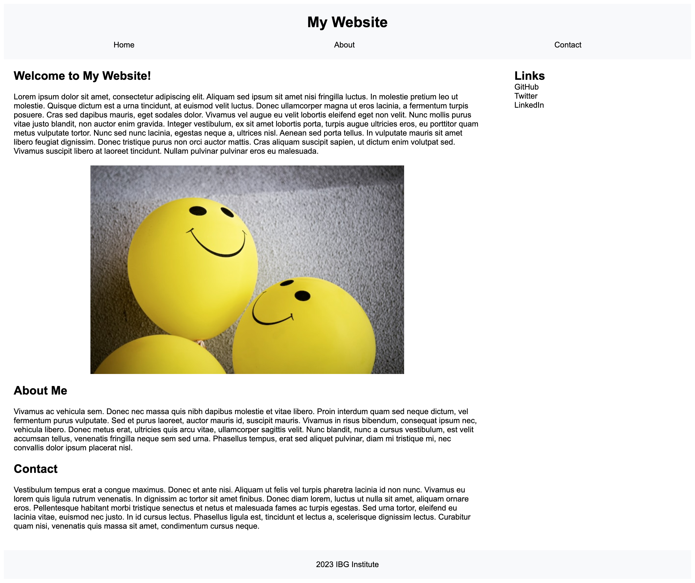

# Refactor - Semantic HTML and CSS

## Context
As the world increasingly shifts to digital platforms, web semantics have become critical to ensure that search engines and assistive technologies can correctly interpret the content on a webpage. Semantically correct websites can enhance SEO rankings, improve accessibility, and overall, provide a better user experience.

Semantics in HTML and CSS are essential for creating well-structured and maintainable code. In addition to refactoring the HTML with semantic elements, it is important to refactor the CSS file to follow best practices, such as consolidating selectors and properties, organizing them to match the semantic structure of the HTML elements, and adding comments before each element or section of the page.

In order to excel as a web developer, you should always strive to improve the codebase beyond the given requirements. For example, ensure that all images are correctly referenced and optimized, and improve the CSS by applying consistent naming conventions, using appropriate units for measurements, and optimizing styles for different screen sizes.

Are you ready for the challenge? Here are the task requirements.

## User Story
**AS A** junior web developer 
**I WANT** a codebase that adheres to semantic HTML and CSS principles 
**SO THAT** the website is optimized for search engines, assistive technologies and maintainability

## Task List
### Task 1: Refactor HTML with Semantic Elements
- The existing `index.html` uses general HTML tags
- Your task is to refactor the HTML, replacing general HTML tags with semantic HTML elements wherever possible

### Task 2: Ensure Logical Structure of HTML Elements
- The structure of the HTML elements should follow a logical sequence, independent of the CSS styling and positioning
- Confirm that your refactored HTMl maintains this logical structure

### Task 3: Provide Alt Attributes for Image Elements
- The HTML file includes an image
- Ensure this image has a relevant alt attribute, enhancing accessibility for users relying on screen readers.

### Task 4: Confirm Sequential Order of Heading Attributes
- The HTML file should include heading tags
- Confirm that the heading tags fall in a sequential order, improving document outline and accessibility

### Task 5: Refactor CSS for Improved Organization and Readability
- The existing `style.css`  file contains CSS rules
- Refactor the CSS file by consolidating selectors and properties, organizing them to match the semantic structure of the HTML elements, and adding comments before each element or section of the page

### Task 5: Refactor HTML with Semantic Elements
- The HTML file includes a `<title>` tag in the `<head>` section
- Ensure the title is concise, descriptive, and relevant to the content of the webpage

Each task aligns with the fundamental principles of semantic HTML, accessibility, SEO-friendly practices and maintainable CSS code. Once completed, the website should appear the same to the end user (as shown in the screenshot below), but the underlying code will be significantly improved. This will make it more efficient, accessible, and easier to maintain.

To help you complete this assignment, refer to the [MDN Docs](https://developer.mozilla.org/en-US/docs/Glossary/Semantics#semantics_in_html) and other relevant resources you find on the internet.

Example semantic HTML tags: `<header>`, `<footer>`, `<nav>`, `<section>`, `<article>`, `<aside>`, `<main>` 

### EXTRA HTML CHALLENGES
- Make the links active using anchor tags.
- Ensure the links in the navigation bar direct users to the section of the web page that has the corresponding name.
- Configure links to external sites to open in a new window.
- Add a language attribute to the anchor tags to provide information to screen readers about the language of the linked resource.
- Utilize ARIA roles to signify the roles of elements, which can assist assistive technology in comprehending your content.
- Add a 'lang' attribute to the HTML tag.

### EXTRA CSS CHALLENGES
- Group common properties
- Group similar selectors
- Use shorthand properties
